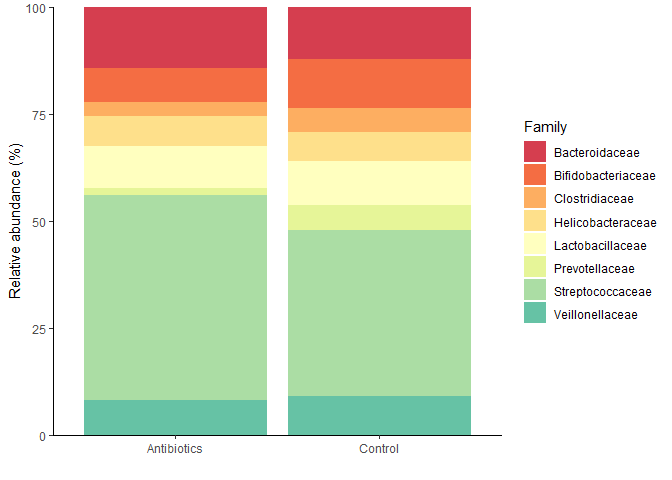

Stack Barplot for taxonomy
================
Sebastián Sáenz
17/11/2020

We are going to use **ggplot** to create our barplot. Load the library
**tidyverse** or install it in case you have not done it before.

``` r
library(tidyverse)
```

    ## -- Attaching packages -------------------------------------------------------------------------------------------- tidyverse 1.3.0 --

    ## v ggplot2 3.3.2     v purrr   0.3.4
    ## v tibble  3.0.3     v dplyr   1.0.2
    ## v tidyr   1.1.2     v stringr 1.4.0
    ## v readr   1.3.1     v forcats 0.5.0

    ## -- Conflicts ----------------------------------------------------------------------------------------------- tidyverse_conflicts() --
    ## x dplyr::filter() masks stats::filter()
    ## x dplyr::lag()    masks stats::lag()

Load the data files. The file `mock_tax.txt` containst the taxonomic
annotation and `meta_tax.txt` contains the metadata of the samples.

`check.names` prevent that R would change your column names. Use `str()`
to get information about your data files. In this case we have 17 rows
and 8 columns in the `mock_tax.txt` . `str()` also show you what kind of
variables you have.

``` r
taxonomy_df <- read.table("mock_tax.txt",
                 header = TRUE,
                 sep = "\t",
                 check.names = FALSE)

meta_df <- read.table("meta_tax.txt",
                      header = TRUE,
                      sep = "\t",
                      check.names = FALSE)


str(taxonomy_df)
```

    ## 'data.frame':    17 obs. of  8 variables:
    ##  $ Phylum: chr  "Bacteroidetes" "Actinobacteria" "Firmicutes" "Firmicutes" ...
    ##  $ Family: chr  "Prevotellaceae" "Bifidobacteriaceae" "Clostridiaceae" "Lactobacillaceae" ...
    ##  $ 1A    : int  740 130 715 450 858 537 746 600 423 942 ...
    ##  $ 1B    : int  265 804 822 927 820 736 632 262 860 581 ...
    ##  $ 1C    : int  605 296 170 428 807 988 618 925 452 738 ...
    ##  $ 2A    : int  621 907 345 681 690 889 681 1072 973 865 ...
    ##  $ 2B    : int  160 948 679 692 626 660 1182 1722 1171 1711 ...
    ##  $ 2C    : int  60 218 781 64 385 527 1894 1864 1834 1566 ...

``` r
str(meta_df)
```

    ## 'data.frame':    6 obs. of  2 variables:
    ##  $ Sample   : chr  "1A" "1B" "1C" "2A" ...
    ##  $ Treatment: chr  "Control" "Control" "Control" "Antibiotics" ...

Next, Calculate the relative abundance using a function.

``` r
tax_rel_abu <- apply(taxonomy_df[3:8], 2, function(x){(x/sum(x))*100})
```

Let´s check if the data was transformed correctly by summing the
abundance of every taxa in each sample. The result must be 100 per
column.

``` r
colSums(tax_rel_abu)
```

    ##  1A  1B  1C  2A  2B  2C 
    ## 100 100 100 100 100 100

The new df **tax\_rel\_abu** only contains the relative abundances. The
taxonomic data should be merge with this file.

``` r
rel_abu_tax <- cbind(taxonomy_df[1:2], tax_rel_abu)
```

Check the new df **rel\_abu\_tax**

Following, transform the df to a longer format as it is easier to use
with **ggplot**. We create two new variables **Treatment** and
**Abundance**. Treatment would receive all the column names and
Abundance all the values. `head()` would show you the first rows of your
df.

``` r
rel_df_long <- pivot_longer(rel_abu_tax, cols = c(3:8),
             names_to = "Sample",
             values_to ="Abundance")

head(rel_df_long)
```

    ## # A tibble: 6 x 4
    ##   Phylum        Family         Sample Abundance
    ##   <chr>         <chr>          <chr>      <dbl>
    ## 1 Bacteroidetes Prevotellaceae 1A         8.23 
    ## 2 Bacteroidetes Prevotellaceae 1B         2.22 
    ## 3 Bacteroidetes Prevotellaceae 1C         6.65 
    ## 4 Bacteroidetes Prevotellaceae 2A         3.81 
    ## 5 Bacteroidetes Prevotellaceae 2B         0.827
    ## 6 Bacteroidetes Prevotellaceae 2C         0.344

After, use the metadatata `meta_df` to add information about your
samples to our taxonomy df

``` r
full_rel_abu <- full_join(rel_df_long, meta_df, by = "Sample")

head(full_rel_abu)
```

    ## # A tibble: 6 x 5
    ##   Phylum        Family         Sample Abundance Treatment  
    ##   <chr>         <chr>          <chr>      <dbl> <chr>      
    ## 1 Bacteroidetes Prevotellaceae 1A         8.23  Control    
    ## 2 Bacteroidetes Prevotellaceae 1B         2.22  Control    
    ## 3 Bacteroidetes Prevotellaceae 1C         6.65  Control    
    ## 4 Bacteroidetes Prevotellaceae 2A         3.81  Antibiotics
    ## 5 Bacteroidetes Prevotellaceae 2B         0.827 Antibiotics
    ## 6 Bacteroidetes Prevotellaceae 2C         0.344 Antibiotics

Now we have 102 rows and 5 columns, including metadata about treatment.

After, we calculate the mean relative abundance of every Family among
the treatments. We can use `group_by()` to establish groups of data.
Then those groups would be summarise with a new variable that we create.
In this case the new variable is **relative\_abundance**. You can create
several new variables to describe your samples. Lets add the standard
deviaton of the abundances `sd = sd(Abundance)`

``` r
mean_relative_abundace <- full_rel_abu %>%
    group_by(Family, Treatment) %>%
    summarise(mean_rel = sum(Abundance)/3,
              sd = sd(Abundance))
```

    ## `summarise()` regrouping output by 'Family' (override with `.groups` argument)

## Plotting

Finally, we can plot our data. Lets try 3 different versions of barplot.
In all of them we have to use `geom_bar(stat = 'identity')`, because we
do not want any statistical transformation of our data.

### 1a) Normal stack barplot, automatic colors

``` r
mean_relative_abundace %>%
  ggplot(aes(x = Treatment, 
             y = mean_rel, 
             fill = Family)) +
  geom_bar(stat = 'identity') +
  labs(x = "", y = "Relative abundance (%)") +
  scale_y_continuous(expand = c(0, 0)) +
  theme_classic()
```

<!-- -->

### 1b) Stack barplot, add colors manually

You can get differetn palletes codes or color codes from
[ColorBrewer](https://colorbrewer2.org/#type=sequential&scheme=BuGn&n=3)

``` r
col_list <- c('#d53e4f','#f46d43','#fdae61','#fee08b','#ffffbf','#e6f598','#abdda4','#66c2a5','#3288bd')

mean_relative_abundace %>%
  ggplot(aes(x = Treatment, 
             y = mean_rel, 
             fill = Family)) +
  geom_bar(stat = 'identity')+
  labs(x = "", y = "Relative abundance (%)") +
  scale_fill_manual(values = col_list) +
  scale_y_continuous(expand = c(0, 0)) +
  theme_classic()
```

<!-- -->

### 2\) Unstack bars using `position = position_dodge()`.

You can use the standar deviation with `geom_errorbar()`

``` r
mean_relative_abundace %>%
  ggplot(aes(x = Treatment, y = mean_rel, fill = Family)) +
  geom_bar(stat = 'identity',
           position = position_dodge()) +
  geom_errorbar(aes(ymin = mean_rel-sd, ymax = mean_rel+sd), width=.2,
                 position=position_dodge(.9)) +
  ylab("Relative abundance (%)") +
  xlab("") +
  scale_y_continuous(expand = c(0,0)) +
  theme_classic()
```

<!-- -->

### 3\) An independent plot for every Family using `facet_wrap(~Family)`.

``` r
mean_relative_abundace %>%
  ggplot(aes(x = Treatment, y = mean_rel, fill = Family)) +
  geom_bar(stat = 'identity',
           position = position_dodge()) +
  geom_errorbar(aes(ymin=mean_rel-sd, ymax=mean_rel+sd), width=.2,
                 position=position_dodge(.9)) +
  ylab("Relative abundance (%)") +
  xlab("") +
  facet_wrap(~Family) +
  scale_y_continuous(expand = c(0,0)) +
  theme_classic()
```

<!-- -->
