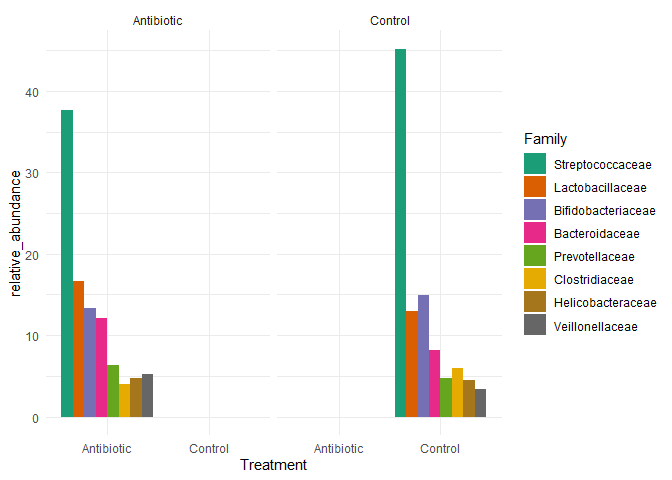
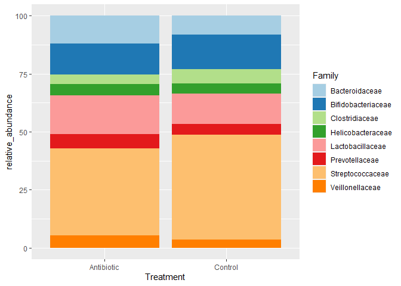

Stack Barplot for taxonomy
================
Sebastián Sáenz
30/10/2020

We are going to use **ggplot** to create our barplot. Load the library
**tidyverse** or install it in case you have not done it before.

``` r
library(tidyverse)
```

    ## -- Attaching packages ------------------------------------------------------------- tidyverse 1.3.0 --

    ## v ggplot2 3.3.2     v purrr   0.3.4
    ## v tibble  3.0.3     v dplyr   1.0.2
    ## v tidyr   1.1.2     v stringr 1.4.0
    ## v readr   1.3.1     v forcats 0.5.0

    ## -- Conflicts ---------------------------------------------------------------- tidyverse_conflicts() --
    ## x dplyr::filter() masks stats::filter()
    ## x dplyr::lag()    masks stats::lag()

Next we are going to load our data. The relative abundance of the
different taxa were previously calculated. **check.names** prevent that
R would change your column names. Use **str()** to get information about
your data frame. In this case we have 17 rows and 8 columns. **str()**
also show you what kind of variable you have.

``` r
df <- read.table("mock_tax.txt",
                 header = TRUE,
                 sep = "\t",
                 check.names = FALSE)

str(df)
```

    ## 'data.frame':    17 obs. of  8 variables:
    ##  $ Phylum    : Factor w/ 4 levels "Actinobacteria",..: 2 1 3 3 3 1 4 3 3 3 ...
    ##  $ Family    : Factor w/ 8 levels "Bacteroidaceae",..: 6 2 3 5 7 2 4 7 7 7 ...
    ##  $ Control   : num  3.18 3.95 6.69 11.78 5.18 ...
    ##  $ Control   : num  10.06 8.33 4.21 3.31 10.53 ...
    ##  $ Control   : num  1.12 5.66 7.11 5.45 3.61 ...
    ##  $ Antibiotic: num  7.1 2.4 4.12 8.9 4.7 ...
    ##  $ Antibiotic: num  3.43 8 4.82 5.91 1.89 ...
    ##  $ Antibiotic: num  8.29 9.64 3.23 8.27 6.26 ...

``` r
colSums(df[3:8])
```

    ##      Control    Control.1    Control.2   Antibiotic Antibiotic.1 Antibiotic.2 
    ##          100          100          100          100          100          100

Next we transform our df to a longer format as it is easier to use with
**ggplot**. We create two new variables **Treatment** and **Abundance**.
Treatment would receive all the column names and Abundance all the
values.

``` r
df_long <- pivot_longer(df, cols = c(3:4),
             names_to = "Treatment",
             values_to ="Abundance")

str(df_long)
```

    ## tibble [102 x 4] (S3: tbl_df/tbl/data.frame)
    ##  $ Phylum   : Factor w/ 4 levels "Actinobacteria",..: 2 2 2 2 2 2 1 1 1 1 ...
    ##  $ Family   : Factor w/ 8 levels "Bacteroidaceae",..: 6 6 6 6 6 6 2 2 2 2 ...
    ##  $ Treatment: chr [1:102] "Control" "Control" "Control" "Antibiotic" ...
    ##  $ Abundance: num [1:102] 3.18 10.06 1.12 7.1 3.43 ...

Now we have 102 rows and 4 columns.

``` r
relative_abundace <- df_long %>%
    group_by(Family, Treatment) %>%
    summarise(relative_abundance = sum(Abundance)/3)
```

    ## `summarise()` regrouping output by 'Family' (override with `.groups` argument)

## Ploting

``` r
sort.class <- relative_abundace %>% 
  count(Family, wt = relative_abundance) %>%
  arrange(desc(n)) %>%
  pull(Family) 

relative_abundace %>%
count(Family, wt =relative_abundance)
```

    ## # A tibble: 8 x 2
    ## # Groups:   Family [8]
    ##   Family                 n
    ##   <fct>              <dbl>
    ## 1 Bacteroidaceae     20.3 
    ## 2 Bifidobacteriaceae 28.3 
    ## 3 Clostridiaceae     10.1 
    ## 4 Helicobacteraceae   9.31
    ## 5 Lactobacillaceae   29.7 
    ## 6 Prevotellaceae     11.1 
    ## 7 Streptococcaceae   82.8 
    ## 8 Veillonellaceae     8.59

``` r
relative_abundace %>%
  mutate(Family = factor(Family, levels = sort.class)) %>%
  ggplot(aes(x = Treatment, 
             y = relative_abundance, 
             fill = Family)) +
  geom_bar(stat = 'identity',
           position = position_dodge()) +
  scale_fill_brewer(palette = "Dark2") +
  facet_wrap(~Treatment) +
  theme_minimal()
```

<!-- -->

``` r
col_list <- c('#a6cee3','#1f78b4','#b2df8a','#33a02c','#fb9a99','#e31a1c','#fdbf6f','#ff7f00')

relative_abundace %>%
  ggplot(aes(x = Treatment, y = relative_abundance, fill = Family)) +
  geom_bar(stat = 'identity') +
  scale_fill_manual(values = col_list)
```

<!-- -->
